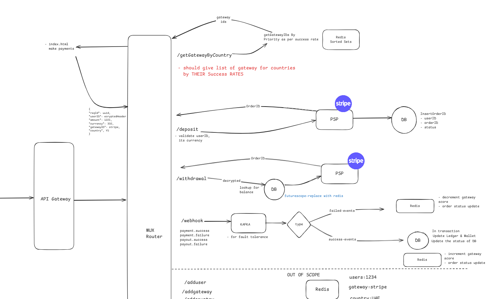

# Payment Gateway Integration Assessment
## System Design



### Tasks Done
- ✅ Payment Gateway Integration service supports Stripe and a Default Custom made payment gateway.
- ✅ by `/gateway/:countryID`, user can get list of payment gateways ranked by their success rate. This rate is maintained as per gateway to country payment successs ratio.
- ✅ Using `/deposit` a payment intent is created.
- ✅ After successfull payment / failed payment, ledger and transaction is updated by webhook event generated by third party gateway.
- ✅ Currently `/withdrawal` support is given by default payment gateway.
- ✅ All webhook events are process `Asynchronously` using kafka.
- ✅ Open API config is can be accessed at `/swagger/index.html`
- ✅ Unit test cases for `gateway selection by success ratio` & `stripe webhooks` is developed.
- ✅ circuit breaker logic added to `stripe deposit` feature


## Task Overview


This assessment evaluates your skills in implementing a robust and scalable payment gateway integration system within a trading platform. The system must accommodate multiple third-party payment gateways based on country and region, with support for configuring gateway priority, implementing failover mechanisms, and ensuring system resilience.

You will work with a skeleton codebase that includes prebuilt functionality, which will assist you in the implementation. You are required to implement two key endpoints and also handle the callback from gateways to update the transaction status asynchronously. Your code should support different formats depending on the gateway-supported format (your code should support at least JSON and SOAP).


You will implement the following endpoints:

- `/deposit`: For processing deposit transactions.
- `/withdrawal`: For processing withdrawal transactions.

In addition to implementing these endpoints, you will handle callback responses from gateways asynchronously to update the transaction status.

### Database

The database helpers can be found under `db/db_helpers.go`, and the migration/init file is under `db/init.sql`.

**Hint:** The project has Docker configured, which includes PostgreSQL, Kafka, and Redis, making it easier for you to get started. However, it's not mandatory to use these services in your solution. The decision to use them depends on the architecture you design for this task.

### Helpers

- **`api/router.go`**: The `/deposit` and `/withdrawal` endpoints are pre-defined using `gorilla/mux`.
- **`db_helpers.go`**: This file contains helper functions for interacting with the database, such as CRUD operations.
- **`db/init.sql`**: This is the SQL file used for the database migrations. It defines the schema for the `gateways`, `countries`, `transactions`, and `users` tables.
- **`kafka/publisher.go`**: This file contains helper functions for publishing messages to Kafka.
- **`services/data_format_services.go`**: This file contains functions to decode the request based on the data format (content type). You are required to create a similar function for encoding the response.
- **`services/fault_tolerance.go`**: This file contains helper functions for implementing fault tolerance such as circuit breakers and retry mechanisms.
- **`services/security.go`**: This file contains helper functions for masking and unmasking data using base64 encoding (Feel free to change the algorithm for better security).

### Requirements

1. **Endpoints Implementation:**
    - Implement the `/deposit` and `/withdrawal` endpoints to process transactions.
    - Each endpoint should accept a JSON/SOAP payload with details such as `amount`, `user_id`, `gateway_id`, `country_id`, and `currency`.
    
2. **Callback Handling:**
    - Implement the logic to handle the callback from third-party gateways to update the transaction status asynchronously.
    - The callback will include information like transaction status and should be used to update the corresponding transaction in the database.
    
3. **Transaction Status:**
    - Each transaction must include a status field (e.g., "pending", "completed", "failed") which should be updated when the callback is received.
    
4. **Data Formats:**
    - Your solution should support at least two data formats: JSON and SOAP. You should decode the request in the appropriate format (as defined in `services/data_format_services.go`), and you should also create a function for encoding the response.
    
5. **Unit Tests:**
    - Write unit tests to cover the business logic, especially for the endpoints, transaction processing, and callback handling.
    - Test for edge cases and failure scenarios, such as handling invalid input, network issues, and unexpected failures from the gateway.

6. **Fault Tolerance:**
    - Implement fault tolerance for your solution using the retry mechanisms and circuit breakers found in `services/fault_tolerance.go`.

7. **Security:**
    - Use the provided helper functions in `services/security.go` to mask and unmask sensitive data before publishing to Kafka or logging it.
    
### How to Get Started

1. **Clone the Repository:**
    Clone the repository to your local machine:

    ```bash
    git clone [<repository_url>](https://gitlab.com/exinity-hiring/payment-gateways.git)
    cd <project_directory>
    ```

2. **Setup Docker:**
    Docker is configured to run PostgreSQL, Kafka, and Redis. Use the following command to start all the services:

    ```bash
    docker-compose up -d
    ```

    This will start:
    - PostgreSQL on port `5432`
    - Kafka on ports `9092` and `9093`
    - Redis on port `6379`
    - Application on port `8080`

3. **Database Migration:**
    The migration file `db/init.sql` is already provided. Once the Docker services are up and running, the database will be initialized automatically, and the tables will be created.


### Deliverables

- Implement the `/deposit` and `/withdrawal` endpoints.
- Handle the callback from third-party gateways to update the transaction status.
- Ensure that the solution supports multiple data formats (at least JSON and SOAP).
- Implement fault tolerance and retry mechanisms where necessary.
- Write unit tests to ensure the correctness and resilience of your solution.
- Provide clear and concise documentation, including any architectural decisions or assumptions made and API documentation.

### Important Files

- **`db/db_helpers.go`**: Helper functions for interacting with the database.
- **`db/init.sql`**: SQL migration file to initialize the database.
- **`api/router.go`**: Defines the API routes (`/deposit` and `/withdrawal`).
- **`services/data_format_services.go`**: Functions for handling different data formats.
- **`services/fault_tolerance.go`**: Functions for implementing fault tolerance, including retries and circuit breakers.
- **`services/security.go`**: Helper functions for masking/unmasking sensitive data.

### Time Limit

You have **3 hours** to complete this task.

---

Good luck and happy coding!
